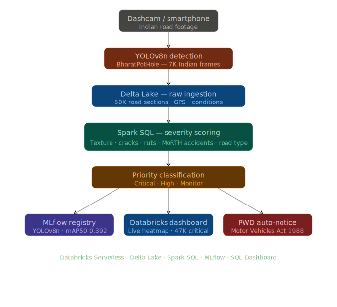

# Pothole Heatmap — India Road Health Monitor

AI-powered crowdsourced road monitoring system that detects potholes from 
dashcam footage and generates a real-time priority heatmap with automated 
PWD alerts for municipal authorities across Indian cities.

## Architecture

Dashcam Video Frames
↓
YOLOv8n (trained on BharatPotHole dataset - Kaggle GPU)
↓
Pothole Detections + GPS coordinates
↓
Delta Lake (raw ingestion via Apache Spark)
↓
Severity Scoring Engine (Spark SQL)

Road condition indicators (texture, cracks, ruts)
MoRTH accident history weighting
Road type priority multiplier
↓
Priority Labels: CRITICAL / HIGH / MONITOR
↓
MLflow Model Registry + Databricks SQL Dashboard
↓
Auto-generated PWD Notice (Motor Vehicles Act 1988)

## Databricks Components Used
- **Delta Lake** — stores raw road sections, scored results, YOLO detections, PWD alerts
- **Apache Spark SQL** — severity scoring engine joining road conditions and accident data
- **MLflow** — model registry for YOLOv8n pothole detector
- **Databricks SQL Dashboard** — live priority heatmap
- **Serverless Compute** — all notebooks run serverless

## Datasets
- BharatPotHole (Kaggle) — 7,000+ Indian dashcam frames in YOLO format
- Synthetic road sensor data — 50,000 sections across 6 cities generated using PySpark
- Severity scoring inspired by Abed et al. (2023) pavement condition research

## How to Run

### Step 1 — Train YOLO model on Kaggle
1. Open Kaggle and add dataset: surbhisaswatimohanty/bharatpothole
2. Enable GPU T4 accelerator
3. Run all cells in 02_train_yolov8_kaggle.ipynb
4. Download pothole_best.pt from Kaggle output

### Step 2 — Setup Databricks
1. Upload best.pt to /Volumes/workspace/default/pothole_models/
2. Run 00_setup_python.ipynb — generates Delta Lake tables with 50,000 road sections
3. Run 01_mlflow_inference.ipynb — registers model in MLflow
4. Run 02_severity_scoring.ipynb — scores all road sections and generates PWD alerts
5. Open Databricks Dashboard: Pothole Heatmap - India Road Health Monitor

## Demo Steps
1. Open the Databricks Dashboard link below
2. Observe 47,100+ critical road sections flagged nationwide
3. Check Top 10 Highest Risk Road Sections table
4. Open 02_severity_scoring notebook, Cell 5 — read auto-generated PWD notice
5. Open MLflow Experiments — pothole_heatmap_experiment — view model metrics

## Live Dashboard
[Pothole Heatmap - India Road Health Monitor]((https://dbc-8785c366-12b2.cloud.databricks.com/dashboardsv3/01f14026fa1f1ac7ad349d522e4428cf/published?o=7474647709257499))

## Model Performance
| Metric | Value |
|--------|-------|
| mAP50 | 0.392 |
| Precision | 0.497 |
| Recall | 0.421 |
| Training data | 7,000+ Indian dashcam frames |
| Training platform | Kaggle Tesla T4 GPU |

## Tech Stack
- Databricks Serverless, Delta Lake, Spark SQL, MLflow
- YOLOv8n (Ultralytics)
- Python, PySpark
- Kaggle Tesla T4 GPU for training
